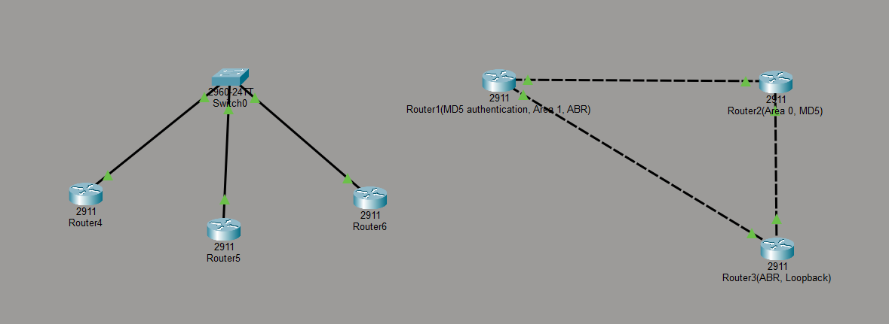

# Scalable Multi-Area OSPF Network — Redundancy, Security & Fault Diagnosis

A hands-on OSPF lab built in Cisco Packet Tracer, covering single-area and multi-area design, DR/BDR election, redundant equal-cost paths, authentication, route summarization, and real troubleshooting scenarios diagnosed from scratch.

## Overview

This project simulates a small multi-router network using OSPF as the routing protocol. It was built incrementally over one week, with each stage adding a new layer of real-world complexity — starting from a basic 2-router adjacency and ending with a two-area design featuring redundancy, security, and summarization.

## Topology


**Area 0 (Backbone):**
- R1 — R2 — R3 in a triangle (R1-R2, R2-R3, and a direct R1-R3 link)
- R2 has no connection outside Area 0

**Area 1:**
- The direct R1-R3 link was reassigned into Area 1, making both R1 and R3 Area Border Routers (ABRs)
- Two additional loopback networks (10.1.1.0/24, 10.1.2.0/24) added behind R3, summarized into a single 10.1.0.0/22 route advertised into Area 0

**Separate multi-access segment (its own Area 0):**
- R4, R5, R6 connected via a single switch to demonstrate a real DR/BDR election on a broadcast-type network, independent of the main topology

### IP Addressing

| Link/Network | Subnet | Devices |
|---|---|---|
| R1 – R2 | 10.0.12.0/30 | R1: .1, R2: .2 |
| R2 – R3 | 10.0.23.0/30 | R2: .2, R3: .1 |
| R1 – R3 (Area 1) | 10.0.13.0/30 | R1: .1, R3: .2 |
| R3 Loopbacks (Area 1) | 10.1.1.0/24, 10.1.2.0/24 | summarized as 10.1.0.0/22 |
| R4/R5/R6 segment | 10.0.100.0/24 | R4: .1, R5: .2, R6: .3 |

## Concepts & Skills Demonstrated
## Verification

**DR/BDR election — three routers, real election result:**


**ECMP — two equal-cost paths to the same network:**


**MD5 authentication enabled on an OSPF interface:**


- OSPF neighbor state machine (Down → Init → 2-Way → ExStart → Exchange → Loading → Full)
- Single-area and multi-area (Area 0 + Area 1) configuration
- ABR behavior and inter-area (O IA) route propagation via Type 3 LSAs
- DR/BDR election on a multi-access (broadcast) segment, including election "stickiness"
- Equal-Cost Multi-Path (ECMP) redundancy and OSPF cost manipulation (`ip ospf cost`)
- MD5 authentication between OSPF neighbors, including verifying the security failure mode
- Route summarization at the ABR (`area range`) and its role in fault containment
- Structured troubleshooting methodology: symptom → interface-level check → comparative check between neighbors → fix → verify

## Configuration Highlights

**OSPF process on an ABR (R3):**
```
router ospf 3
 router-id 3.3.3.3
 network 10.0.23.0 0.0.0.3 area 0
 network 10.0.13.0 0.0.0.3 area 1
 network 10.1.1.0 0.0.0.255 area 1
 network 10.1.2.0 0.0.0.255 area 1
 area 1 range 10.1.0.0 255.255.252.0
```

**MD5 authentication (R1 ↔ R2 link):**
```
interface GigabitEthernet0/0
 ip ospf authentication message-digest
 ip ospf message-digest-key 1 md5 NocLab2026
```

## Troubleshooting Log

Every one of these was a real issue hit and independently diagnosed during the build — not simulated after the fact.

| # | Symptom | Diagnostic Command | Root Cause | Fix |
|---|---|---|---|---|
| 1 | New router's OSPF process wouldn't start | `show ip interface brief` | Interface typo (`GigabitEthernet 0/0` with a space) left the interface down | Re-entered command correctly, confirmed `no shutdown` brought interface up |
| 2 | Neighbor never appeared despite interface being up | `show run` / `show ip interface brief` | Mistyped IP address placed the router on the wrong subnet entirely | Corrected IP to match the intended subnet |
| 3 | New router's OSPF neighbor never formed | `show ip ospf neighbor` | Typo'd `network` statement (`12.0.x.x` instead of `10.0.x.x`) — silently ignored by IOS, no error | Corrected the network statement to match the actual interface subnet |
| 4 | Route summarization had no effect on the routing table | `show ip route ospf` | Summary mask typo — used `/24` (`255.255.255.0`) instead of `/22` (`255.255.252.0`), so the range didn't actually cover the target networks | Corrected the mask to `/22` on both ABRs |
| 5 | Neighbor disappeared after a timer change | `show ip ospf interface` (compared Hello/Dead values on both routers) | Hello interval manually changed on one router only, breaking the required match with its neighbor | Reverted with `no ip ospf hello-interval` |
| 6 | Neighbor disappeared, identical symptom to #5 | `show ip ospf interface` (compared Area values on both routers) | OSPF area reassigned on one side of a link only | Corrected the `network` statement's area to match on both sides |

**Issue #5 in action — Hello-timer mismatch breaking the adjacency:**


**Key takeaway from the log:** issues #5 and #6 produced an *identical* symptom in `show ip ospf neighbor` (neighbor simply missing) despite having completely different root causes — proving that a single command is rarely enough to diagnose an OSPF adjacency failure. Real troubleshooting requires comparing specific values (timers, area, authentication, MTU) between both ends of a link, not just observing that something is broken.

## Key Learnings

- OSPF `network` statement typos fail silently — no error is raised, making systematic verification (`show ip ospf neighbor` after every change) essential rather than optional.
- Redundancy built in a single area can silently disappear when a link is moved into a different area, since OSPF always prefers intra-area routes over inter-area routes regardless of cost.
- Route summarization isn't just about smaller routing tables — it contains instability (route flapping) within the originating area, preventing unnecessary SPF recalculation across the rest of the network.
- DR/BDR election is "sticky" — the first router to reach 2-Way state wins the election, regardless of Router ID or priority, unless the current DR actually fails.
